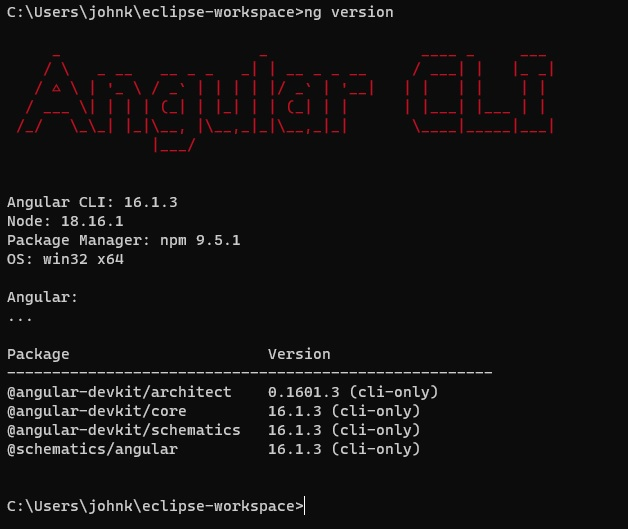
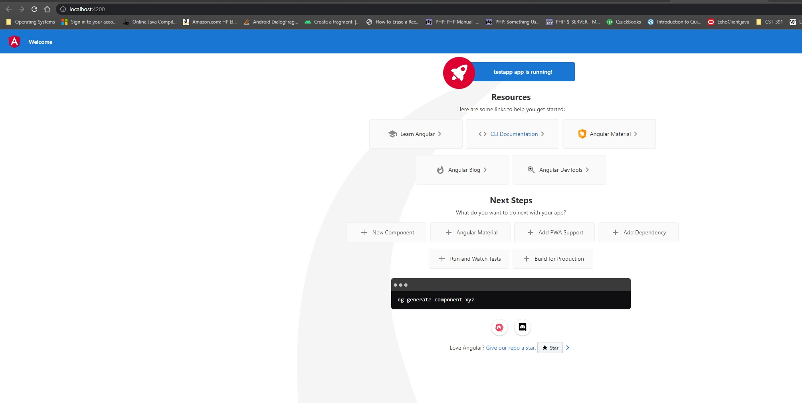
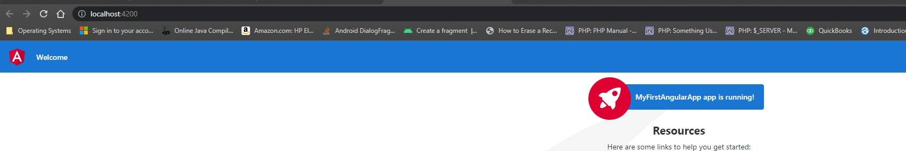
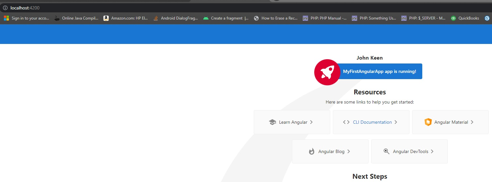

# Activity 2

### Coversheet

---
###### Student: John Keen
###### Professor: Bobby Estey
###### Assignment: Activity 2
###### Date: 7/3/2023

---
### Overview

---
This activity required that I create an angular application.  First I installed the CLI and verified that the angular
CLI was installed correctly by using "ng version."  I launched the application and saw that it was functioning correctly.
I then made a change to the title member variable of the app-root component.  I saw that the component was refreshed in the 
browser just as soon as I saved the change.  I then added my own member variable with the value of my own name.  Then I added
it to the component template in a h3 element.

---
### Screenshots

    Figure 1 - This screenshot shows that Angular CLI is correctly installed.

    Figure 2 - This is my first angular app being run using ng serve -o

    Figure 3 - The title was changed in the component and the title was automatically refreshed in the browser upon saving.

    A new class memeber variable was added to the component and then interpolated in an h3 element of the component template.

---

### Research

###### Part A

| **Important Folders** | **Purpose**                                                                                                                       |
|:---------------------:|:----------------------------------------------------------------------------------------------------------------------------------|
|     Node_Modules      | This folder contains all of the build tools for the project (vvondra, 2015).                                                      |
|          src          | This folder contains all of the project files (Tutorialspoint, n.d.).                                                             |
|        src/app        | This folder contains all of your component files in which your application logic and data are defined (Angular, n.d.a).           |
|      src/assets       | Contains images and other asset files that are copied as is when you build your application (Angular, n.d.a).                     |
|   src/environments    | Contains configuration files to be used depending on the build (testing, production, etc...) of the application (Angular, n.d.b). |

| **Important JSON Files** | **Purpose**                                                                                       |
|:------------------------:|:--------------------------------------------------------------------------------------------------|
|       angular.json       | This holds metadata information like the project name and the CLI version (Tutorialspoint, n.d.). |
|       package.json       | Configures npm packages that are available in the workspace (Angular, n.d.a).                     |
|      tsconfig.json       | This file contains the compiler options required during compilation (Tutorialspoint, n.d.).       |

###### Part B
Explain how the resultant page was generated by Angular by providing a brief overview and purpose for each of the following files:
main.ts, app.component.css, app.component.html, app.component.ts, and app.module.ts.

The main.ts file is the entry point for the application (Rangle, n.d).  The app.module.ts file defines the root module which is called AppModule (Rangle, n.d.).
Components need to be declared in a module in order to be rendered (Angular, n.d.a).  The app.component.css, app.component.html and app.component.ts files compose the AppComponent which is the root component for the application.  The AppModule is configured to bootstrap the AppComponent and the component will be rendered anywhere that the app-root HTML element is encountered (Rangle, n.d.).  The index.html file uses the app-root element and when index.html is rendered from the server to the browser the component is loaded into the browser.

References

Angular. (n.d.a). https://angular.io/guide/file-structure

Angular. (n.d.b). https://angular.io/guide/build

Rangle. (n.d.). Understanding the file structure. Rangle.io. https://angular-training-guide.rangle.io/bootstrapping/file_structure

Tutorialspoint. (n.d.). ANGULAR7 - project setup. https://www.tutorialspoint.com/angular7/angular7_project_setup.htm

vvondra. (2015, December 30). What is node_modules directory in angularjs?. Stack Overflow. https://stackoverflow.com/questions/34526844/what-is-node-modules-directory-in-angularjs
