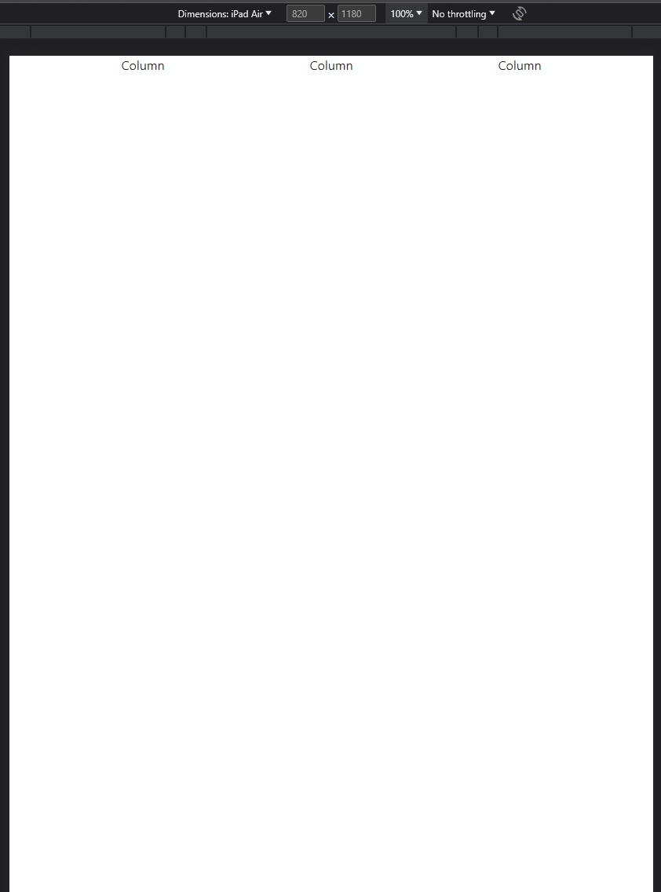
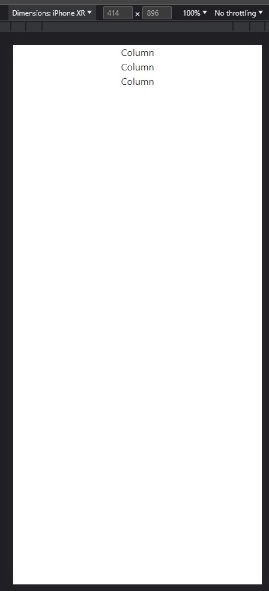
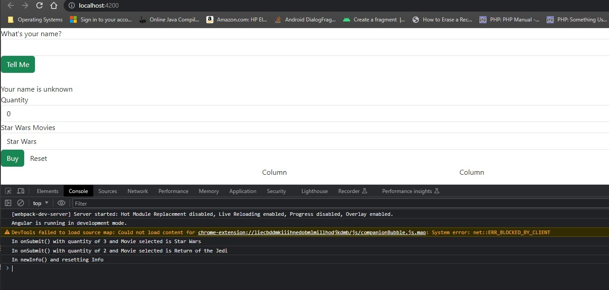
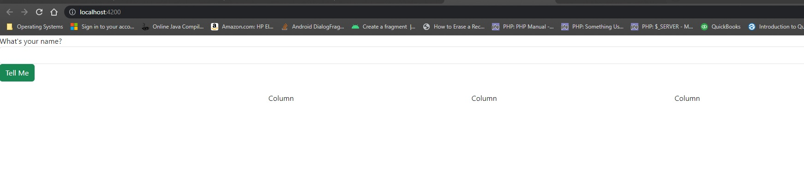
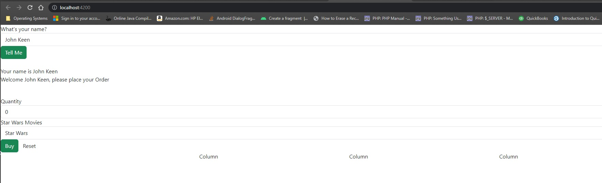
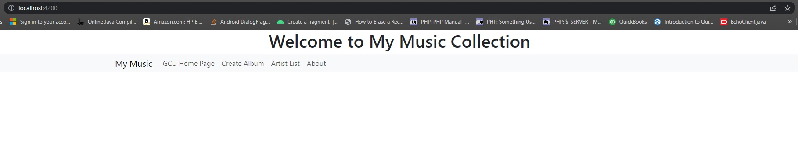
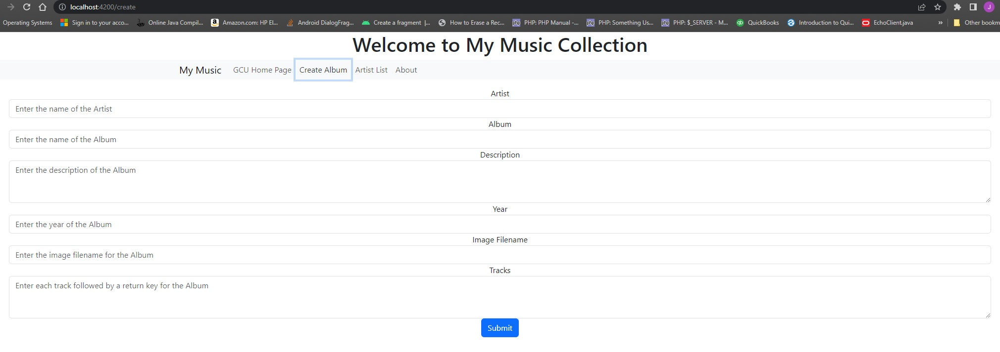
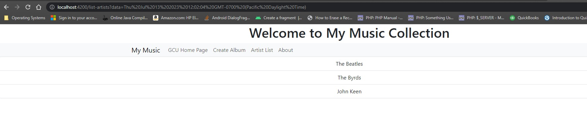
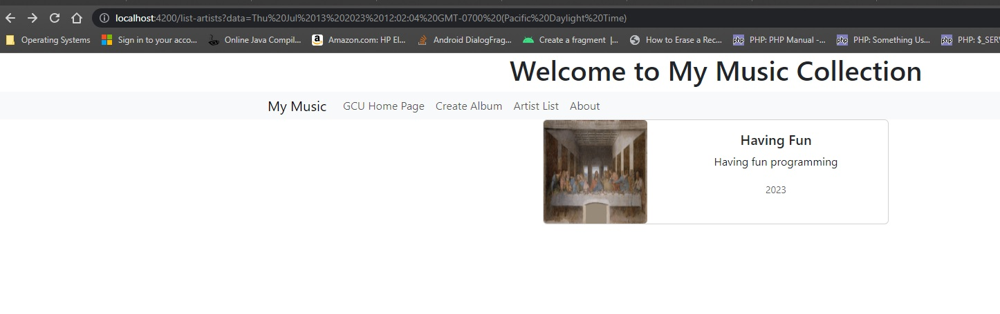
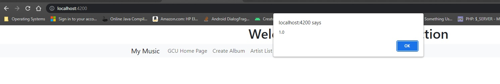

# Activity 3

### Coversheet

---
###### Student: John Keen
###### Professor: Bobby Estey
###### Assignment: Activity 3
###### Date: 7/11/2023

---

### Part 1: Basic Angular Components, Events, Routes, and Data Binding

---
#### Part One Write-up

In this part of the activity two components are created.  The form in the shop component will take a users name.
Then the name is passed to the info component using the @Input() decorator.  The info component and name of the user are only shown if the value of the users name is not unknown.
The form in the info component uses model binding to bind data from controls to properties of a component.
The info component form has two events, one for submitting the form data to the console and another for restoring the data in the form to it's initial state.
The key concepts presented in this part of the activity are component creation, form module implementation and two-way binding.
The activity starts by adding bootstrap to the project and creating a responsive bootstrap grid.

The code for this part of the project can be found here:
[Part One](https://github.com/thunderblue1/simpleapp)

#### Screenshots

    Figure 1 - This screenshot shows that the grid on the IPad has the columns side by side

    
    Figure 2 - This screenshot shows that the IPhone has the grid columns in their own row.
    This demonstrates that the column width is responsive based on the screen sizes.

    Figure 3 - This is a screenshot of the application after adding the info component.
    The application is composed of the shop component and the info component.
    The info component has two event handlers, one for the buy button and one to reset the form.

    Figure 4 - This is a screenshot of the info component hidden because of the ngIf directive

    Figure 5 - This is a screenshot of the info component showing because the  person's name has been entered.
    The info component is showing because the ngIf directive determined that the name of the user is something other than unknown.

#### Part One Research

1.	Describe @Input decorator used in info.component.ts

    The input decorator allows data to be shared from a parent component to a child component (Angular, n.d.a).

2.	Describe [value] used in info.component.html

    This is inherited from AbstractControlDirective (Angular, n.d.b).
    In a form created with FormsModule the control value can be set by using this directive.
    In this case it was an option element of a select form control that had it's value set.

3. Describe [(ngModel)] also used in info.component.html 

    The [(ngModel)] is used to bind data two ways from a model to an input and vice versa (MathMax, 2020).
    In the example app, the [(ngModel)] is being used to bind the data from the form controls to the data in the component.

#### References

Angular. (n.d.a). https://angular.io/guide/inputs-outputs. https://angular.io/guide/inputs-outputs

Angular. (n.d.b). https://angular.io/api/forms/NgForm

MathMax. (2020, March 26). Difference between [(ngmodel)] and [ngmodel] for binding state to property?. Stack Overflow. https://stackoverflow.com/questions/42504918/difference-between-ngmodel-and-ngmodel-for-binding-state-to-property

---
### Part 2: Creating a Music Application – The Front End

---

#### Part Two Write-up

This part of activity 3 required that a music application be created by coping files and writing code.
The music app has a service that loads the albums from a json file containing all of the required albums.
Components will access the data they need by utilizing the service.  When the "Artist List" link in the Navbar is clicked on the "list-artist" component is loaded
into the "router-outlet" element.  If an artist is not selected then all of the artists are displayed.
Once an artist is selected (clicked on) then the div iterating over the artists is hidden and the "list-albums" component is shown.
This is done using an NgIf directive.  NgIf directives are further used to hide all of the albums listed in the "list-album" component if a single album is selected and then
 show the "display-album" component for the selected album.  The key concepts presented in this activity include using a data service in angular, using routes, placing child components in a parent component and using directives to hide or show blocks of code in a view.

The code for this part of the project can be found here:
[Part Two](https://github.com/thunderblue1/musicapp)

#### Screenshots

    Figure 1 - This is the initial page that is loaded when the server is run

    Figure 2 - This is the GCU Homepage that is loaded when the link in the navbar is clicked on

    Figure 3 - This is the "create-album" component loaded into the single page application when the "Create Album" link is clicked on.
    The "create-album" component" is loaded into "router-outlet" element of the root component.

    Figure 4 - This is a list of Artists loaded as a componenent when the "Artist List" link is clicked on.
    The component loaded is the list-artists component and it is loaded into the "router-outlet" element of the root component.
    It shows the new artist of the newly created album.

    Figure 5 - This is the "display-album" component loaded after the artist and then album was clicked on.
    This figure was included to demonstrate the successful creation of an album.
    This component uses the selector name of "app-display-album"

    Figure 6 - The "About" link will execute an alert that pops up an alert box with the version number.
    This was per the activity instructions and works as expected.

#### Part Two Research

This part of the activity required commenting the music-service.service.ts file.

[Commented Code](CommentedCode.md)

---
