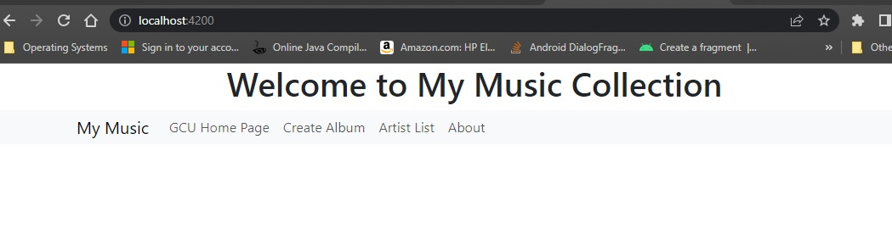

# Activity 4

### Coversheet

---
###### Student: John Keen
###### Professor: Bobby Estey
###### Assignment: Activity 4
###### Date: 7/19/2023

---

### Activity 4: Finish the Music Application - Integration with Back End

---
#### Write-up

This activity required that I finish the music application front end using angular.
The flat file containing all of the album data was swapped out for the database in the service.
The rest of the application was updated to implement the updated service methods.
I had to update the code for font awesome in order to get the icons to work in the album display.
I also had to update the code for the newer version of bootstrap so that the UI would collapse and expand.
I created an edit component that will load the data from an album into a form and update the album information (not tracks)
upon submission.  I also created a delete component that will display information regarding the deleted album.
For testing purposes, I logged the success of the delete operation to the console.
Create, read, update and delete operations are all working as I would expect.  The only downside is that the tracks update
for the DAO and UI was not designed well and would take extensive work to get it to operate as I would imagine it.
The edit component was engineered as the author of the activity had envisioned it.  The angular application is now integrated with the REST API.

The code for this part of the project can be found here:
[Angular Music App](https://github.com/thunderblue1/musicapp)

#### Screenshots

    This is the Main Application Screen

    This is the Artist List Screen.  The application loads the artist-list component into the router-outlet.

    This is the Album List Screen.  The application hides the artists list and shows the list-album component.
    The component is shown by using an ngIf directive and the app-list-albums selector.

    This is the Album Display Screen.  The application hides the albums list and shows the display-album component.
    The component is shown by using an ngIf directive and the app-display-album selector.
    The show list, edit album and trash links are functional.

    This is the Add Album Screen.  The user can create an album by filling in this form.
    It is the create-album component and is loaded into the router-outlet when a routerLink is clicked on in the nav bar.
    This form in this component was provided by GCU.

    This is the Edit Album Screen.  The data in the form is populated using a service.
    The album is accessed from the database by album id and then the properties of the album fill the form by using binding.
    The tracks do not update correctly because the tracks input is a text area and the tracks are converted to an array.
    The tracks entity has five fields and in order to update each track correctly the operation (delete, update, create) would also
    need to be kept track of.  Gaining functionality out of the update method of the tracks DAO in the API would be an entire project all in itself.
    I went with the UI that was intended by the author of the project.

    An album was deleted and a response was logged to the console.

    An album was deleted and a the delete-album component was loaded into the router-outlet.
    An ActivateRoute was injected into the component using constructor injection
    and the parameters were taken from the url and used to create a custom message.

#### Research

1.	Research how an Angular application maintains a logged in state. How does it communicate this state to the server?

In order to maintain a state in an angular application, session storage can be used (Vu, 2019).  Angular uses RxJS library for reactive programming (Angular, n.d.b).
The RxJS library provides something called an observable that is used in Angular's HttpClient for sending requests and receiving data (Angular, n.d.a).
Instead of catching the data all at once the data is sent as a stream which allows a streaming state to be achieved (Angular, n.d.a).  This state can be canceled and requests are easily retried (Angular, n.d.a).
For session storage, a cookie is created by the server so that the server can uniquely identify a browser (Gaur, 2022).  When a session variable needs to be updated the browser
will send the cookie to identify it as the correct user agent to the server.  Another way that angular appears to maintain a logged in state is that the entire application is loaded into the browser and when the application requires downloading data from 
the server a request is sent asynchronously.  The effect is that the user appears to be logged in and is capable of accessing web application pages even when offline.

#### References

Angular. (n.d.a). Observables in Angular. https://angular.io/guide/observables-in-angular

Angular. (n.d.b). https://angular.io/guide/rx-library

Gaur, C. (2022, November 1). Local storage VS session storage vs cookie. Real Time Data and AI Company. https://www.xenonstack.com/insights/local-vs-session-storage-vs-cookie

Vu, L. (2019, October 22). Implement session storage in an angular 8 application. Stack Overflow. https://stackoverflow.com/questions/58500879/implement-session-storage-in-an-angular-8-application

---