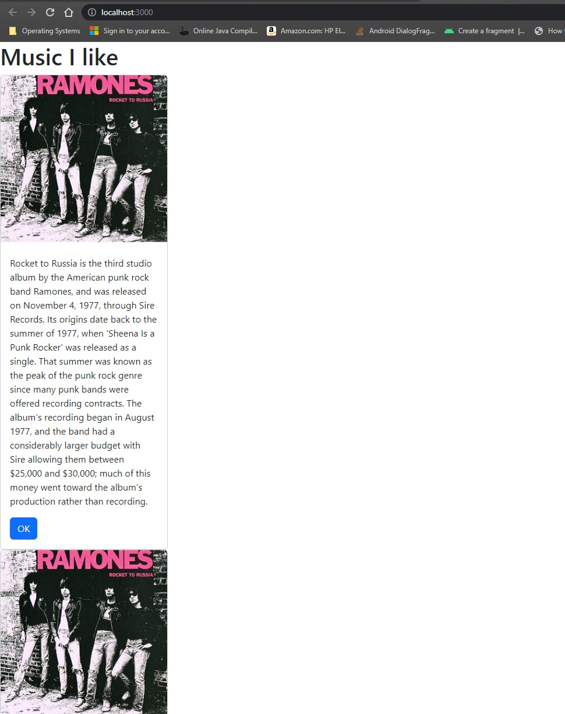
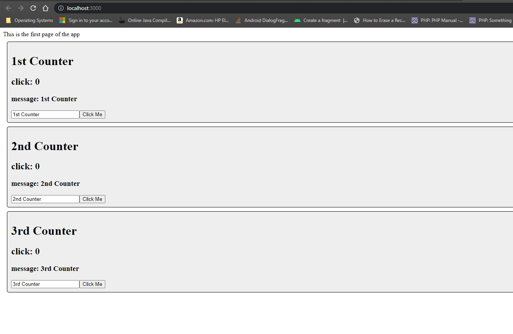
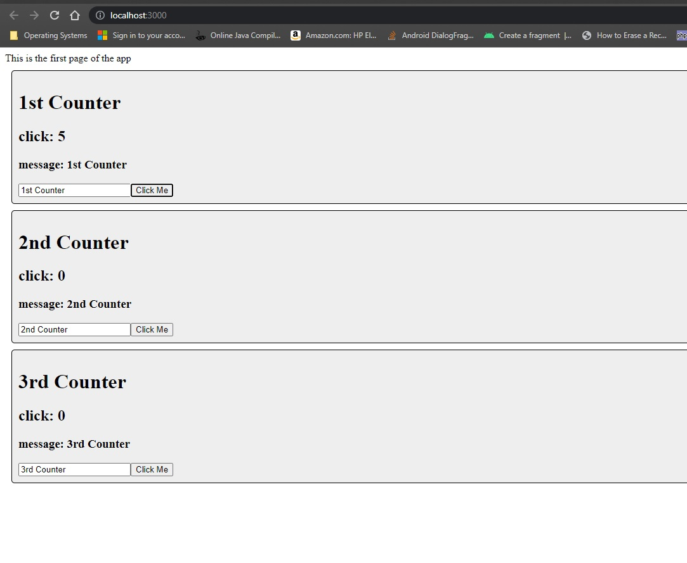
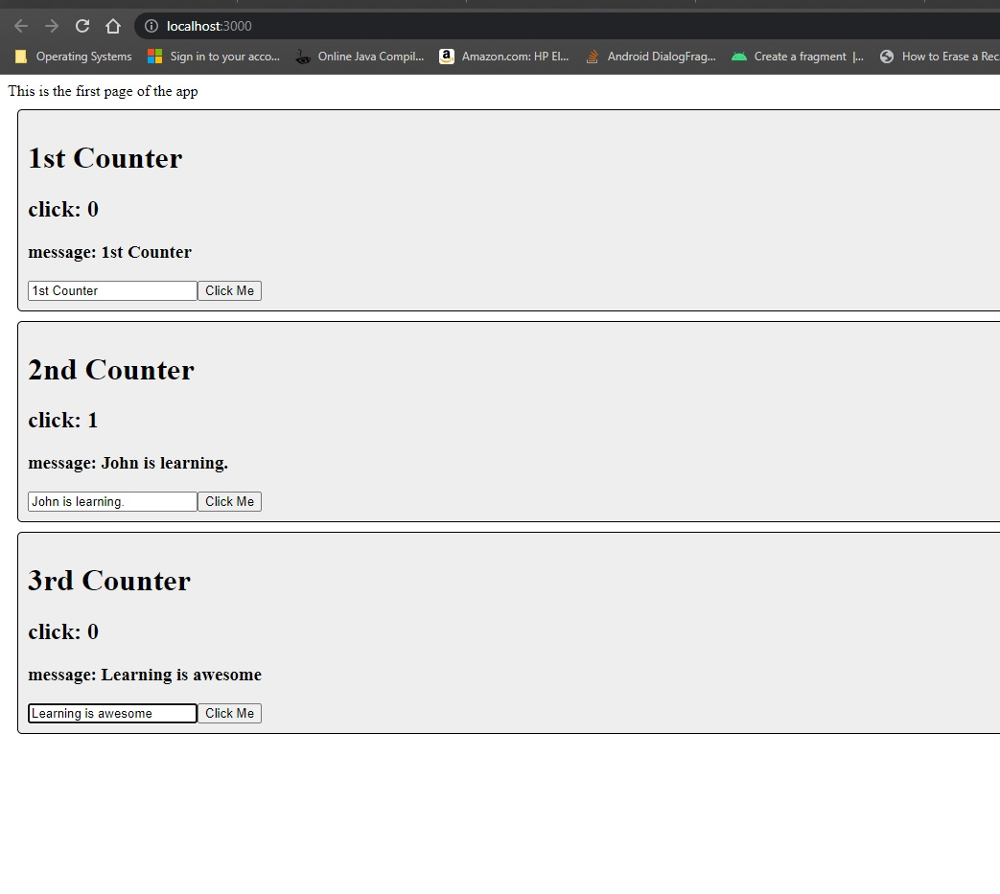
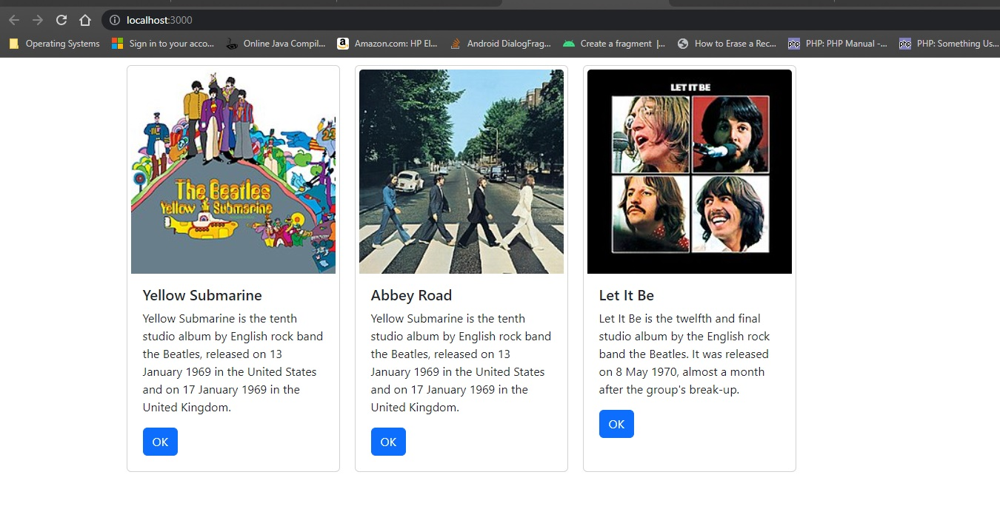

# Activity 5

### Coversheet

---
###### Student: John Keen
###### Professor: Bobby Estey
###### Assignment: Activity 5
###### Date: 7/25/2023
###### Code: [Mini App](https://github.com/thunderblue1/statechanger), [React Music App](https://github.com/thunderblue1/music)

---

### Activity 5: React Tools & Music App Fixed Data

---

### Part 1: Custom Components

#### Activity Summary Page

##### Introduction to React

This part of the activity required that a simple React app be created and that three card components be placed inside
the main App component.  The entire application is loaded into the div with an id of root in the index.html using ReactDOM.render.
A component is a reusable bit of code that is used to create a React application (w3schools, n.d.).
A component can have properties called props.  The props from the component in HTML get passed to the function of the component
so that the props can be used in JSX.  JSX stands for JavaScript Syntax Extension and it is like HTML but is actually JavaScript.
JSX is Reacts way of using JavaScript to produce elements to be rendered in the DOM.

##### Mini App #1 - State Changer Demo

This app demonstrates the use of hooks.  An event calls a handler and the handler updates the hook.  The component and 
any of its children is then updated.  A React hook is a function that allows the state of the React application and lifecycle features
to be "hooked into" (React, n.d.).  In the case of the mini app created,  one state is the count and the other is the message of the component.

The code for this part of the activity can be accessed here:
[Mini App](https://github.com/thunderblue1/statechanger)

#### References

React. (n.d.). Hooks at a glance. https://legacy.reactjs.org/docs/hooks-overview.html

w3schools. (n.d.). React components. https://www.w3schools.com/react/react_components.asp#:~:text=Components%20are%20independent%20and%20reusable,will%20concentrate%20on%20Function%20components.

#### Screenshots

    The application that was required to be made upto stopping point one.
    A card component was made and three cards were put in the main App component.
    An App component is loaded into the div with an id of "root" in the index.html file.

    This shows the initial loading of the app with all the values set to their default values

    This shows that the first component has updated the state for the counter hook without affecting the state of any of the other components.

    This shows that the onchange handler for the input boxes change the state of each component and updates the component
    as the input box is being typed in.

### Part 2 Using State and Props in the Music Application

#### Activity Summary Page

In this part of the activity a state and a hook is created.  The state is populated with an array of albums.
The array that is stored as a state and is iterated over using map.  Map is used to map cards to a new array using the object's properties.
Eventually the state will be updated using the hook or function that was created.  CSS was used to create a stylized grid so that the cards
are not stacked on top of each other.  The new terminology that was introduced in this section was map.  The map function can be used on an array
and takes a callback function that will process each element and store it into an array.  The map function will return an array.  There is very little functionality in the user interface at this point in the music apps development.

The code for this part of the activity can be accessed here:
[React Music App](https://github.com/thunderblue1/music)

#### Screenshots

    An array of objects is saved as a state.
    The array is iterated over and cards are mapped to a returned array using the data from the objects.
    CSS is used to stylize the cards on the screen.  Eventually the state will be updated with the created hook.
