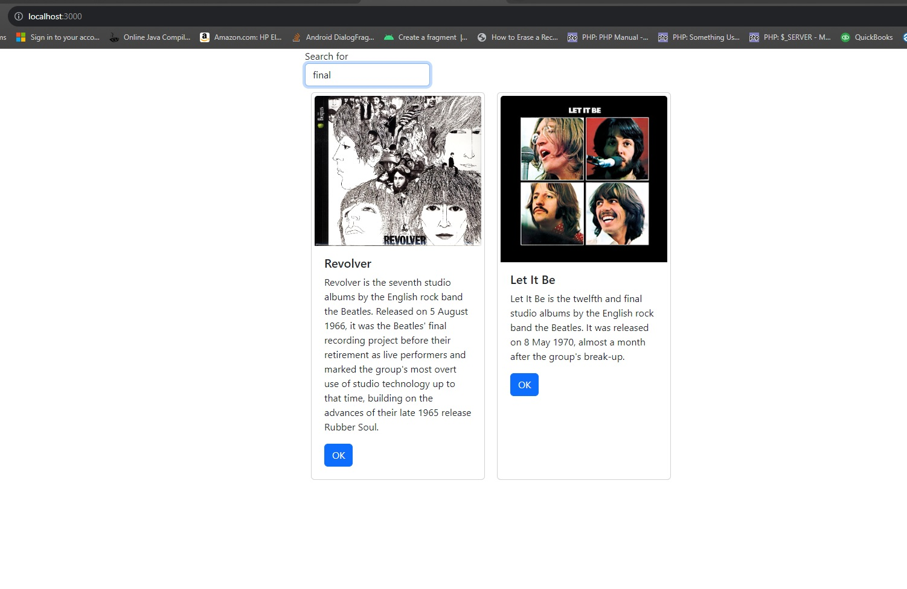

# Activity 6

### Coversheet

---
###### Student: John Keen
###### Professor: Bobby Estey
###### Assignment: Activity 6
###### Date: 8/2/2023
###### Code: [React Music App](https://github.com/thunderblue1/music), [Mini App #2](https://github.com/thunderblue1/router)

---

## Activity 6: React Music App API Data

---

### Part 3 External Data Source 

##### Summary

In this part of the activity an external data source was added to the app.  The activity started by explaining lifecycle hooks
and utilizing the useEffect hook in order to set the album list once the component is mounted.  It is then explained that the use
of the map method demands that a key be specified for each element that is rendered by map or an error will be sent to the console.
The index of the array will be used as the default key but that will leave error message in the console and the real solution is to add a unique key.
A search component is then created and a search term in App.js is updated when the search form in the new component is submitted.  The component App.js will iterate over all of the
albums using map and wrap the card component with an if statement in order to conditionally render the UI based on the search phrase.
The activity touches on previously visited topics such as callback hell and promises.  The activity introduces the concept of async and await
which are used to asynchronously run a method and then await for the results so that the asynchronous call appears to be synchronous.

The code for this part of the activity can be accessed here:
[React Music App](https://github.com/thunderblue1/music)

#### Screenshots

    This is the main application screen which loads all of the albums by default.

    The albums are filtered locally and the app does not make another api request.
    Two albums with the search term "final" are found within the dataset procured from the database.

    The application will print the current search term for the component when when there is an onChange event in the input box.
    It also prints to console when there is an album that has a description that does not match the search term.

---

### Mini App #2

##### Summary

In this part of the activity an app is created with a routing capability.  This is achieved using BrowserRouter.
A component called PrivateRoute is created to protect components that are nested inside the PrivateRoute component as children.
Once the user is authorized, the authorized state is changed.  Then the children of the PrivateRoute will be displayed if a link
to the route containing the PrivateRoute component is clicked on.  The "About" and "Contact Us" links are protected with the
PrivateRoute component.  The "User" and "Login" links are not protected.  Links below the navbar will redirect to the /user/:username
route and will display the User component with a custom message using the parameter.

The code for this part of the activity can be accessed here:
[Mini App #2](https://github.com/thunderblue1/router)

#### Screenshots

    This is the page that initially loads when the web app is loaded.

    This shows that the /about route is protected by the PrivateRoute component.
    The other route that is protected using the PrivateRoute component is the /contact route. 

    This is the login page with a single button for logging in.

    This is the about page that is now displayed after the authorized state has been changed to true.
    The children (in this case the AboutUs component) of the PrivateRoute gets returned if the authorized state is true. 

    This is the Contact Us page.
    Since the authorize state is true the ContactUs component is returned from the PrivateRoute component.

    This is the page when the User link is clicked on.

    When a link under the header "Some friends of mine" is clicked the link takes the BrowserRouter to the /User/:username route.
    The parameter is retrieved and a custom message is displayed in the User component which is loaded into the BrowserRouter.

---

### Part 4: Navigation Routing

##### Summary

In this part of the activity routing was added to the web application.  The app was further componentized.
The application has a new navbar that provides links to get back to the main section of the application and to get to the page
which will eventually be used to create new albums.  The SearchAlbum component was added to the application and the method for updating
the searchPhrase state is passed to the search album as props.  The OneAlbum component was added to the application so that the full details of only one album could be displayed.
Currently OneAlbum is not being used but it will be used in the functionality of future versions of the web application.
I personally added the "Show 5" link to demonstrate that the OneAlbum component works.

The code for this part of the activity can be accessed here:
[React Music App](https://github.com/thunderblue1/music)

#### Screenshots

    This is the main page of the React music app and it appears to be the same as before.
    Components were extracted from the existing code and the app was further componentized.
    The SearchAlbum component now holds the SearchForm and the AlbumList components.

    The new page is curently just a stub but demonstrates that routing was added and that the web application has page navigation.
    The Show 5 link is only on the page to provide a way to get to the the newly added OneAlbum component which provides album details.

    The album details page can currently only be accessed through the link that I temporarily provided.
    It provides the details of a specified album and will eventually be incorporated into the functionality of the app.

---