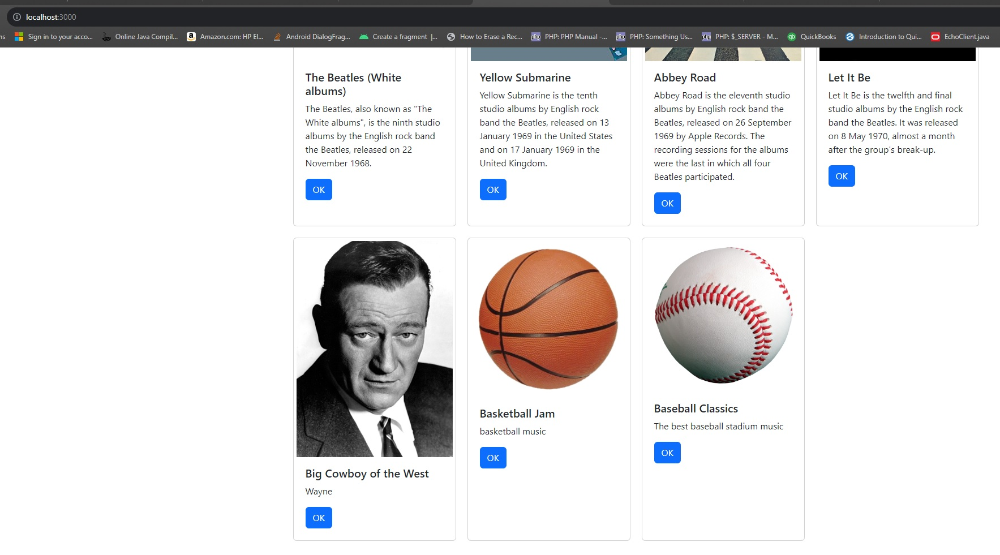
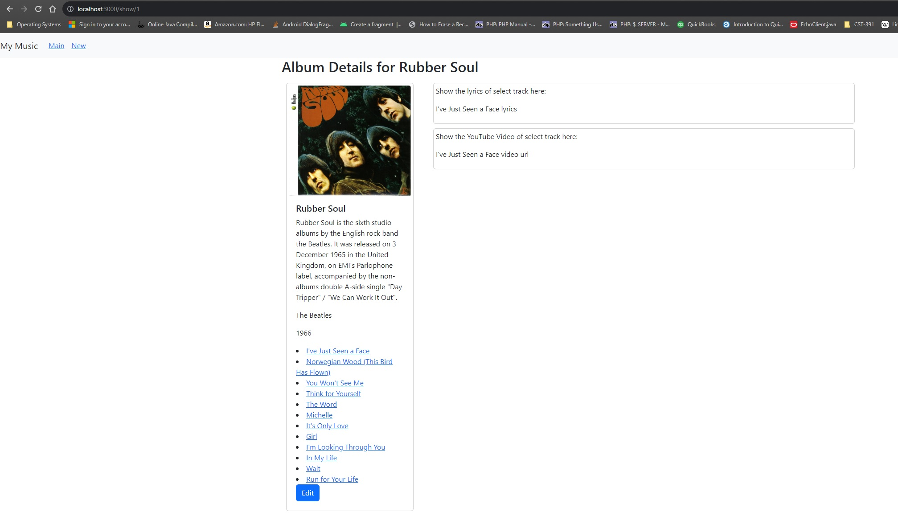

# Activity 7

### Coversheet

---
###### Student: John Keen
###### Professor: Bobby Estey
###### Assignment: Activity 7
###### Date: 8/8/2023
###### Code: [Mini App 3](https://github.com/thunderblue1/blog), [React Music App](https://github.com/thunderblue1/music)

---

## Activity 7: React Music App Completion

---

### Mini App #3 – Dynamic Components Demo

##### Summary

In this activity blog objects are dynamically added and removed from a list.
The application starts with hard coded objects being stored in an array and saved in the state variable postList.
Each object of the postList state is then mapped to cards that are stored in an array and then displayed on the screen.
The state postId keeps track of the next blog id to be used.  An event handler called handleAddPost is passed to the child
component called AddPost and is called when the form in AddPost is submitted.  The data from the text area is passed to the handler which
is used to reassign the postList state to include a newly created object using the passed data.  The postId is then updated to a count one greater
than its previous value.  The handleDeletePost handler is passed to the child component of Post.  The id of the blog is passed to the post
component in the props object and is then passed to the handleDeletePost handler when the delete button is click on.  The handleDeletePost handler
will filter out the post with the same id passed to the handler and then reassign the remaining values to a new array.
The hook setPostList for the postList state is called to reassign the new array.  The spread operator was introduced in this
activity.  The spread operator will take the values of an array and spread them out to be used as individual parameters.

The code for this part of the activity can be accessed here:
[Mini App 3](https://github.com/thunderblue1/blog)

#### Screenshots

    This is the main application screen that loads the hard coded blogs by default.

    This demonstrates that a blog can be deleted and shows that the number 1 blog has been deleted.

    This shows that blogs can be added and that the number 3 blog has been added.

---

### Part 5 Tracks, Lyrics and Video

##### Summary

This was an optional challenge.  In this part of the activity I was supposed to extract four components out of 
OneAlbum.  The four components are TrackTitle, TrackList, TrackVideo and TrackLyrics.  I started by changing the column
data for the lyrics and video_url columns for the tracks table in the database.  The default data for these columns was null and it proved to be
problematic.  I created the components and then structured the AlbumOne component using the extracted components.
I then created a route for the /show/:albumId/:trackId path that included the track id.  The TrackTitle has a Link that
is used to change the URL location.  Then the params were received using the useParams hook from the react-router-dom library.
I used a useEffect hook with a parameter of location (created using useLocation) to ensure that the effect will execute every time the location is changed.
The callback function passed to useEffect will either set the currentTrack state to a track that has an id matching the trackId param in the URL
or set the currentTrack state to the first track of the album if there is no match.

The code for this part of the activity can be accessed here:
[React Music App](https://github.com/thunderblue1/music)

#### Screenshots

    This shows that the first track lyrics and video information will be displayed when the album is first navigated to.

    This shows that the yellow submarine lyrics and video is shown if the yellow submarine track is selected in the track list.

---

### Part 6: Create New Album

##### Summary

In this part of the activity we implemented the use of an album creation form.  It utilized controlled components in order
to update the state that represents the value of each field.  The inputs and text area's values were set using a state and then
an event handler is called on the onChange event.  The event handler uses a hook to set the state that is assigned to each of the
form controls.  A optional challenge was to find a way to add tracks for each album.  I utilized the same code that was used in the
angular app to create the function that processes the tracks.  The tracks are extracted from the state that is assigned to a text area.
Another challenge was to notify the user of the status of the new album insertion into the database.  I used an alert just before
the page navigates to the page that displays all of the albums.  This way the user can see the status of their album insertion and then
see the album that they inserted (per the instructions).  

The code for this part of the activity can be accessed here:
[React Music App](https://github.com/thunderblue1/music)

#### Screenshots

    This is the album creation form.  The fields are controlled components.
    The cancel button takes the user to the album display page.
    The submit button calls an event handler that uses Axios to perform a post request to the music API.

    This is the alert message that is displayed upon the completion of the album insertion into the database.
    A success message is shown if the insertion was a success and a fail message is shown if something went wrong.

    The page will navigate to the main screen once the form is processed to show the insertion of the new album.
    This demonstrates the successful insertion of three albums each with their own image and data.

### Part 7: Edit an Album

##### Summary

This part of the activity required that the NewAlbum component be refactored to the EditAlbum component so that it could
double as a form to edit an existing album.  The tracks creation should have been separated from the album creation but they are now
inseparable in the front end and as the consequence of the poorly designed back end I now have an update anomaly where multiple records
need updated or deleted simultaneously.  I would personally have a separate way to update, delete or create new tracks for an album in the
OneAlbum component where the tracks for the album are displayed.  This would be a time consuming venture.  Creating a functionality to update tracks was optional
and this time I opted out.  As of now, all of the features of the website work as expected.

The code for this part of the activity can be accessed here:
[React Music App](https://github.com/thunderblue1/music)

#### Screenshots

    This shows that the cards now have an OK button that takes the user to the page that displays OneAlbum and an edit
    button that takes the user to a page displaying the edit form.

    This shows that the EditComponent can be used to both create an album and update the album data.

    An alert with a message regarding the status of the creation or update of an album is displayed prior to navigating to the main screen of the application.

    This shows that the album information is correctly displayed when the card OK button is clicked on.

---