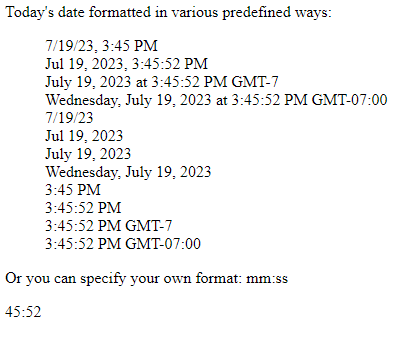
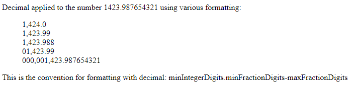
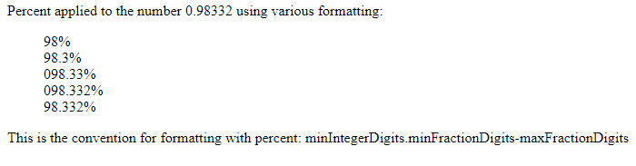

# Pipes

---
###### Student: John Keen
###### Professor: Bobby Estey
###### Assignment: 3 Chosen Pipe examples and Custom Pipe
###### Date: 7/19/2023

---

---
### DatePipe Example

#### format-fun.component.ts:

```typescript
import { Component } from '@angular/core';

@Component({
    selector: 'app-format-fun',
    templateUrl: './format-fun.component.html',
    styleUrls: ['./format-fun.component.css']
})
export class FormatFunComponent {
    today = new Date();
}
```

#### format-fun.component.html:

```html
<p> Today's date formatted in various predefined ways:</p>
<ul style="list-style-type: none;">
  <li>{{today|date:'short'}}</li>
  <li>{{today|date:'medium'}}</li>
  <li>{{today|date:'long'}}</li>
  <li>{{today|date:'full'}}</li>
  <li>{{today|date:'shortDate'}}</li>
  <li>{{today|date:'mediumDate'}}</li>
  <li>{{today|date:'longDate'}}</li>
  <li>{{today|date:'fullDate'}}</li>
  <li>{{today|date:'shortTime'}}</li>
  <li>{{today|date:'mediumTime'}}</li>
  <li>{{today|date:'longTime'}}</li>
  <li>{{today|date:'fullTime'}}</li>
</ul>

<p>Or you can specify your own format: mm:ss</p>
{{today|date:'mm:ss'}}
```

#### In Browser:



---
### DecimalPipe Example

#### decimal-component.ts:

```typescript
import { Component } from '@angular/core';

@Component({
    selector: 'app-decimal',
    templateUrl: './decimal.component.html',
    styleUrls: ['./decimal.component.css']
})
export class DecimalComponent {
    myNumber = 1423.987654321;
}
```
#### decimal-component.html:

```html
<p> Decimal applied to the number 1423.987654321 using various formatting: </p>
<ul style="list-style-type: none;">
  <li>{{myNumber|number:'3.1-1'}}</li>
  <li>{{myNumber|number:'3.1-2'}}</li>
  <li>{{myNumber|number:'3.1-3'}}</li>
  <li>{{myNumber|number:'5.1-2'}}</li>
  <li>{{myNumber|number:'9.9-9'}}</li>
</ul>

<p>This is the convention for formatting with decimal: minIntegerDigits.minFractionDigits-maxFractionDigits</p>
```
#### In Browser:



---
### PercentPipe Example

#### percent.component.ts

```typescript
import { Component } from '@angular/core';

@Component({
  selector: 'app-percent',
  templateUrl: './percent.component.html',
  styleUrls: ['./percent.component.css']
})
export class PercentComponent {
  myNumber = 0.98332;
}
```

#### percent.component.html

```html
<p> Percent applied to the number 0.98332 using various formatting: </p>
<ul style="list-style-type: none;">
    <li>{{myNumber|percent}}</li>
    <li>{{myNumber|percent:'2.1-1'}}</li>
    <li>{{myNumber|percent:'3.1-2'}}</li>
    <li>{{myNumber|percent:'3.1-3'}}</li>
    <li>{{myNumber|percent:'2.1-3'}}</li>
</ul>

<p>This is the convention for formatting with percent: minIntegerDigits.minFractionDigits-maxFractionDigits</p>
```

#### In Browser:



---

### Custom Pipe Example

