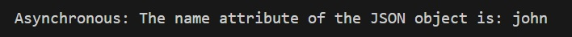
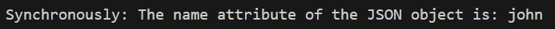

# Loading JSON String From File and Creating TypeScript Object

---
###### Student: John Keen
###### Professor: Bobby Estey
###### Assignment: Loading JSON into TypeScript
###### Date: 7/22/2023

---

---
### Loading JSON into TypeScript Example

#### Asynchronous app.ts

```typescript
import fs = require('fs');

//Asynchronously
var myObject;
fs.readFile('./assets/myfile.json',(err, data)=>{
    if(err) throw err;
    var myContents = data.toString();
    console.log(typeof myContents);
    myObject = JSON.parse(myContents);

    console.log("Asynchronous: The name attribute of the JSON object is: "+myObject.name);
});
```
#### In Console:



---

#### Synchronous app.ts

```typescript
import fs = require('fs');

//Synchronously
var secondObject = JSON.parse(fs.readFileSync('./assets/myfile.json','utf-8'));
console.log("Synchronously: The name attribute of the JSON object is: "+secondObject.name);
```
#### In Console:



---
