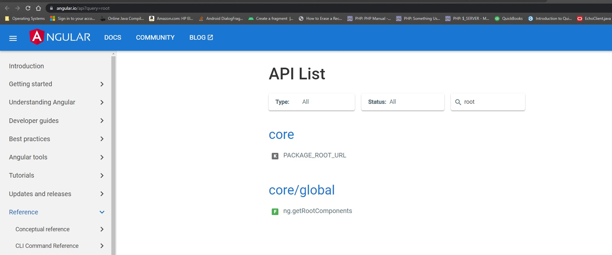
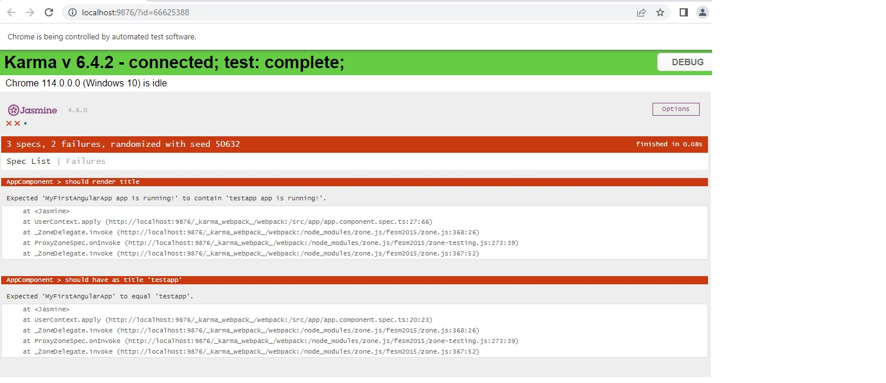
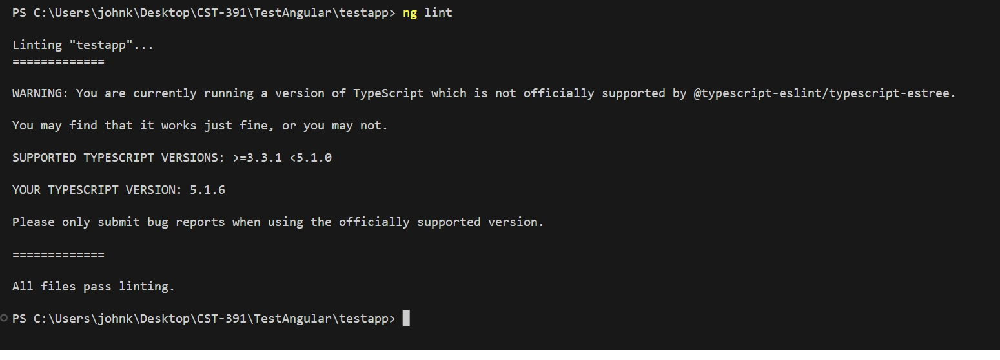

# Discussion on Angular CLI Commands

---
###### Student: John Keen
###### Professor: Bobby Estey
###### Assignment: Angular CLI Discussion
###### Date: 7/3/2023

---

---
### ng doc root

    Figure 1 - This an angular document that outlines parts of a project that are found matching a specified word.

### ng doc test

    Figure 2 - This is a unit test being performed on activity 2 of this week.

    Figure 3 - Linting dependencies were added to an application and it was linted for bugs.

---