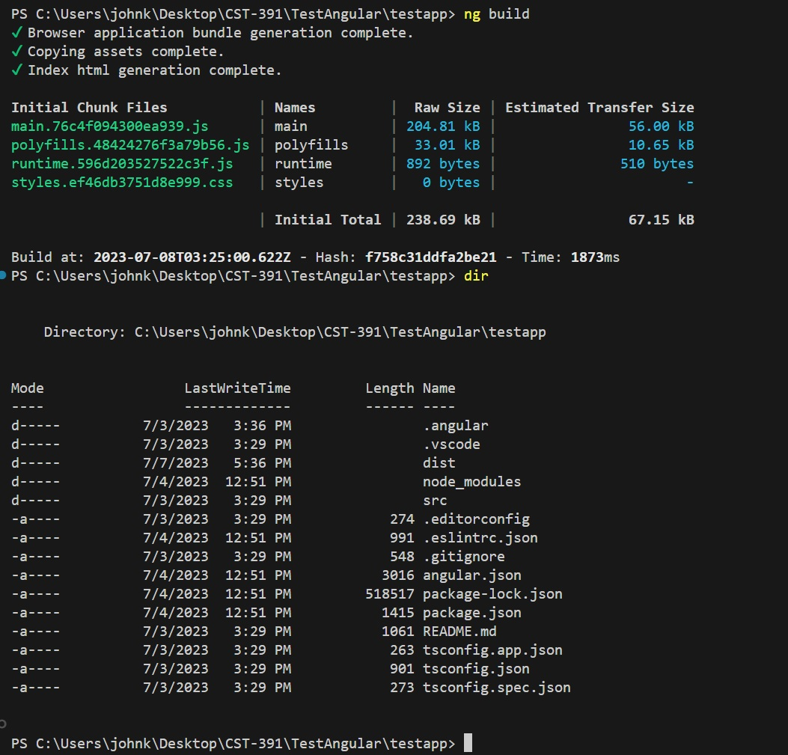
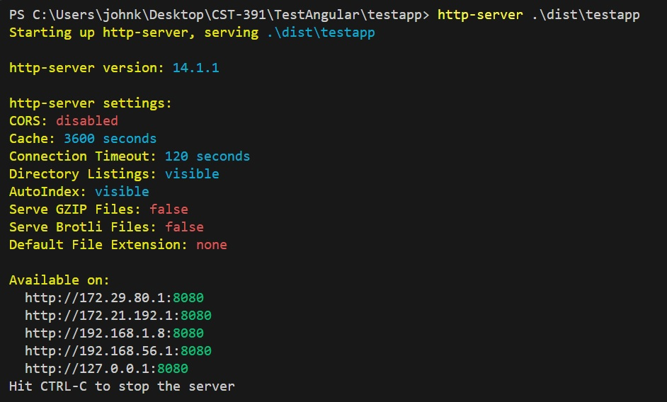
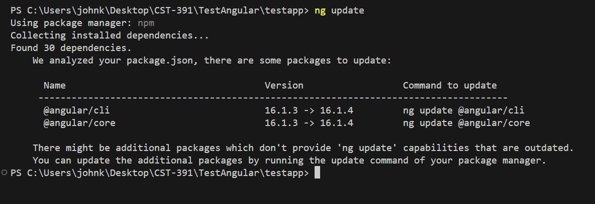

# Another Discussion on Angular CLI Commands

---
###### Student: John Keen
###### Professor: Bobby Estey
###### Assignment: Angular CLI Discussion
###### Date: 7/7/2023

---

---
### ng build

    Figure 1 - This figure shows ng build creating the distro folder and the project folder inside of it.

### http-server distro/testapp

    Figure 2 - This shows a server being launched with the site hosted at 127.0.0.1:8080

### ng update

    Figure 3 - This shows all of my dependecies being updated.

---