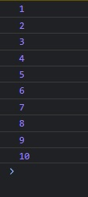

# Component Rendering Based on Props

---
###### Student: John Keen
###### Professor: Bobby Estey
###### Assignment: Component Rendering
###### Date: 8/11/2023

---

---
### Component Rendering Based on Props

Through my experimentation I have found that state is really the reason why a component is rendered again.
How do you change the props values of a child component without rendering the parent again?
My conclusion is that the parent component needs to be rendered again in order for the child component props to be changed.
I have two very similar apps.

The first one renders once and executes the conditional logic once.  Then a button
can be used to update a value of a variable but even if the value of the variable exceeds what is required by the conditional
to render the component with different props, the conditional code will not be executed again.

The second app uses the same conditional code but uses a state instead of a simple variable.
The if conditional is executed again when the state is changed. When the value of the state exceeds what is required by the conditional, 
a different component with a different property value is rendered.

#### Details.js 

##### This is a simple component to display the passed property

```javascript
import React, { useEffect, useState } from 'react';

export default function Details(props) {

    const display = props.passed;

    return (<div>
        <br />
        Passed Property is: {display}
        <br />
    </div>);
}

```

---

#### App.js

##### This component will show one child component only once because the conditional is executed only once

```javascript
import './App.css';
import Details from './Details';
import React from 'react';

function App() {
  let parentCount = 0;
  const FIXED=2;

  const incrementCount = () => {
    parentCount += 1;
    console.log(parentCount);
  }

  if (parentCount>4) {
    return (
      <div className="App">
        <Details passed={parentCount}></Details>
      </div>
    );
  } else {
    return (
      <div className="App">
        <Details passed={FIXED}></Details>
        <button onClick={incrementCount}>Add One</button>
      </div>
    );
  }
  
}

export default App;
```

---

#### App.js

##### This component will show one child component and then eventually render the child component with different props.
##### This is because the state changes and the conditional code is executed every time the parent is rendered

```javascript
import './App.css';
import Details from './Details';
import React, { useState } from 'react';

function App() {
    const [parentCount, setParentCount] = useState(0);
    const FIXED=2;

    const incrementCount = () => {
        setParentCount(parentCount + 1);
        console.log(parentCount);
    }

    if (parentCount>4) {
        return (
            <div className="App">
                <Details passed={parentCount}></Details>
            </div>
        );
    } else {
        return (
            <div className="App">
                <Details passed={FIXED}></Details>
                <button onClick={incrementCount}>Add One</button>
            </div>
        );
    }
}

export default App;

```

---

#### In Browser:


    Both apps will display the component and a button



    No matter how many times the button is pushed in the first app the component does not change it's props.


    In the second app the state will eventually reach five and the component is rendered with a new props.
    A button is not rendered and five is the final number.
    The component is rendered with a different props because the conditional code is executed when the state changes