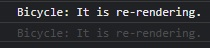
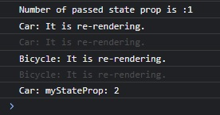

# Component Rendering

---
###### Student: John Keen
###### Professor: Bobby Estey
###### Assignment: Component Rendering
###### Date: 8/11/2023

---

---
### Component Rendering

The idea behind this awfully looking program was simple.  It is to answer a question. 

    What causes a component to render?

The Car and Bicycle component are rendered when the parent component is rendered.  They are rendered again when I click
the "Change State in Parent" button because when the state in the parent is changed, the parent and it's children are reloaded.
They are also re-rendered when a state in the component is changed.  When the "Honk!" or "Ding." button is clicked a state
in the component is changed and the component is re-rendered.

    Does the state have to be used in the JSX of the component to re-render?

As it turns out, no.  If any part of the state of a component is changed then it will re-render.

    Will changing the props of a component re-render a component?

Yes.  Be careful with this though because sometimes a property isn't really changed.
I created a variable with the "let" keyword and then passed it to the "Car" component as a property.
When you click the "Change variable used in props(doesnt' do anything)" button the variable increases in value but
the props is not changed. What changes the value of a property?  A state could be used to set the property but then
the parent component will be rendering again anyways and so will its children.  This is what occurs when you click on the "Change State passed to props"
button.  The props of the child component do change and the child component is updated with the new value for the property.
If there is another way to actually change the props of a component then the component should re-render.
I imagine a conditional rendering based on a changing value would work.

#### App.js

```javascript
import './App.css';
import Car from './Car';
import Bicycle from './Bicycle';
import React, { useState } from 'react';

function App() {
    const [parentState,setParentState] = useState(0);
    const [passedStateProp,setPassedStateProp] = useState(0);

    let myNum=0;
    const changeProps = () => {
        let added = myNum+1;
        myNum = added;
        console.log("Number of myNum is :"+myNum)
    };

    const changeStateProps = () => {
        let added = passedStateProp+1;
        setPassedStateProp(added);
        console.log("Number of passed state prop is :"+passedStateProp)
    };

    const changeState = () => {
        setParentState(parentState+1);
    };

    return (
        <div className="App">
            <Car myNumber={myNum} myStateProp={passedStateProp}/>
            <Bicycle />
            <button onClick={changeProps} >Change variable used in props (doesn't do anything)</button>
            <button onClick={changeStateProps} >Change state passed to props</button>
            <button onClick={changeState} >Change State in Parent</button>
        </div>
    );
}

export default App;
```

---

#### Car.js

```javascript
import React, { useEffect, useState } from 'react';

export default function Car(props) {
    console.log("Car: It is re-rendering.");

    //Component re-renders when button is clicked and state is changed
    const [count,setCount] = useState(0);
    const honk = () => {
        setCount(count+1);
    }

    //Props are changing but component is not re-rendering
    let temp = props.myNumber;
    let sPro = props.myStateProp;

    useEffect(()=>{
        console.log("Car: myNumber: "+props.myNumber);
    },[props.myNumber]);

    useEffect(()=>{
        console.log("Car: myStateProp: "+props.myStateProp);
    },[props.myStateProp]);

    return (<div>Honk, honk!
        <br />
        props.myNumber: {temp}
        <br />
        props.myStateProp: {sPro}
        <br />

        <button onClick={honk}>Honk!</button>
    </div>);
}
```

---

#### Bicycle.js

```javascript
import React from 'react';

export default class Bicycle extends React.Component {
    constructor (props) {
        super(props);
        this.state = {
            count:0
        }
    }
    render () {
        const ding = () => {
            const plusOne = this.state.count+1;
            this.setState({count:plusOne});
        }
        console.log("Bicycle: It is re-rendering.");
        return (<div>Ding, Ding ... Ding.
            <button onClick={ding}>Ding.</button>
        </div>);
    };
}
```

---

#### In Browser:


    This is the program used to test the rendering of components


    The child components are rendered again when the parent state is changed by clicking on "Change State in Parent"


    When the "Honk!" button is clicked on a state in the Car component is changed and the car is rendered again



    When the "Ding." button is clicked on a state in the Bicycle component is changed and the Bicycle is rendered again


    If a local variable is created and passed to props then the child component is not updated even though the value of the variable is changed.
    The value changes but it was only passed to props once.



    Using a state to initialize the property means that the parent component will render again and the value passed to props
    will be changed.  The value of the state is updated and the child components are rendered again.
    The value of the state is successfully passed to the child component as a property.