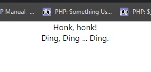

# Functional and Class Component

---
###### Student: John Keen
###### Professor: Bobby Estey
###### Assignment: Functional and Class Component
###### Date: 8/4/2023

---

---
### Functional and Class React Components

#### App.js

```javascript
import './App.css';
import Car from './Car';
import Bicycle from './Bicycle';

function App() {
    return (
        <div className="App">
            <Car />
            <Bicycle />
        </div>
    );
}

export default App;
```

---

#### Car.js

```javascript
export default function Car(props) {
    return <div>Honk, honk!</div>;
}
```

---

#### Bicylce.js

```javascript
import React from 'react';

export default class Bicycle extends React.Component {
    render () {
        return (<div>Ding, Ding ... Ding.</div>);
    };
}
```

---

#### In Browser:


