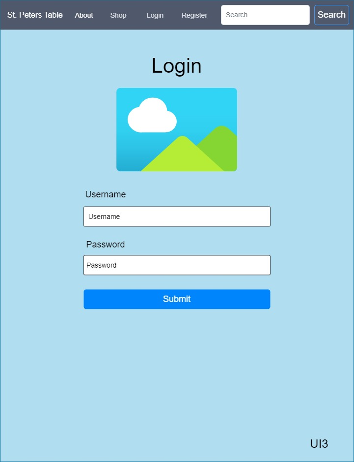

# Cover Sheet

### Class Number: CST-391
### Application Name: PetersTable
### Author: John Keen

---
# Instructor Feedback

John, I LOVE IT!!! You get what I am asking!!! No more uploading ZIP files (I can see your code), no more Office requirements, MARKDOWN does all this for you AND FINALLY!!! This is a LIVING DOCUMENT.

BOTTOM LINE: FANTASTIC SIR - I AM SO PUMPED UP with what you posted. KEEP DOING WELL and GOD BLESS YOU BROTHER, Bobby :-)

---
# Outline of Feedback Addressed

Thank you for your support and encouragement.  I added a section entitled "Introduction to REST API" so that I could clearly outline
the API.  I will continue to refine this document as the application is being developed as you have suggested.

Thank you and God bless you.

---
# Introduction

My organization will be called Saint Peter’s Table.  It is a charitable non-profit organization that will sell bibles to sponsor their good deeds.  Saint Peter’s Table is about bringing people to the table in regard to providing food for them to eat and knowledge for their souls to flourish.  In the bible Jesus had asked Peter to feed and take care of his sheep.

>NIV Version
John 21:15-17
> 
> 15 When they had finished eating, Jesus said to Simon Peter, “Simon son of John, do you love me more than these?”
“Yes, Lord,” he said, “you know that I love you.”
Jesus said, “Feed my lambs.”
16 Again Jesus said, “Simon son of John, do you love me?”
He answered, “Yes, Lord, you know that I love you.”
Jesus said, “Take care of my sheep.”
17 The third time he said to him, “Simon son of John, do you love me?”
Peter was hurt because Jesus asked him the third time, “Do you love me?” He said, “Lord, you know all things; you know that I love you.”
Jesus said, “Feed my sheep.
>
This is not a task that Saint Peter alone should carry and we should all try to carry out the will of God.  We do not believe that God was merely referring to Peters ability to provide food but also to his ability to provide truth and spiritual wisdom that people could consume in order to be fulfilled by the Holy spirit.  Peter was sad because he had betrayed God three times and when Jesus asked Peter to take care of his sheep three times, he knew it was because he had sin that needed forgiven.  We all have sins to be forgiven and we all share Peter’s mission to help those in need.  Bibles will be sold to care for and feed people.

>ESV John 6:35
>
>Jesus said to them, “I am the bread of life; whoever comes to me shall not hunger, and whoever believes in me shall never thirst.
>

---
# Introduction to REST API

---

# Functionality

List of requirements in user story format:

- As a customer I would like to see all the products so that I can browse for the bible I want.
- As a customer I would like to search for a particular product so that I can find the bible I need.
- As a customer I would like to see the details of a product so that I can better know what I am purchasing.
- As a customer I would like to add a product to a cart so that I can make a purchase.
- As a customer I would like to register as a user so that I can log in.
- As a customer I would like to be able to log in so that I can place an order.
- As a sales manager I would like to be able to log in so that I can manage inventory.
- As a sales manager I would like to be able to create a product so that I can update our inventory.
- As a sales manager I would like to browse all the products so that I can browse for a bible that may need information updated.
- As a sales manager I would like to search for a product by multiple criteria so that I can find the product that needs updated.
- As a sales manager I would like to be able to update a product so that I can keep the inventory information current.

---
# Initial Database Design

---
# Initial UI Sitemap

---
# Initial UI Wireframes

---
# Initial UML Classes
 

---
# Risks
I really have to balance my expectations with my available time so that I can stay on task.
My biggest risk is running into bugs and running out of time.  I also may run into risks like type mismatching between
objects returned from SQL and javascript types because I do not have experience using javascript to access SQL.
My lack of experience with typescript, React and Angular may cause me to spend a lot of time looking things up.
Another risk I run into is that the API we are creating is stateless and I may not be able to create a user session.
Without the ability to create a session I could not log in.  There may be a solution for the need for stateful connections
in Angular and React.  It may take time to learn stateful connections in Angular and React.
Learning such things may fall outside the scope of the activities and be a hindrance to the planned course of learning.

