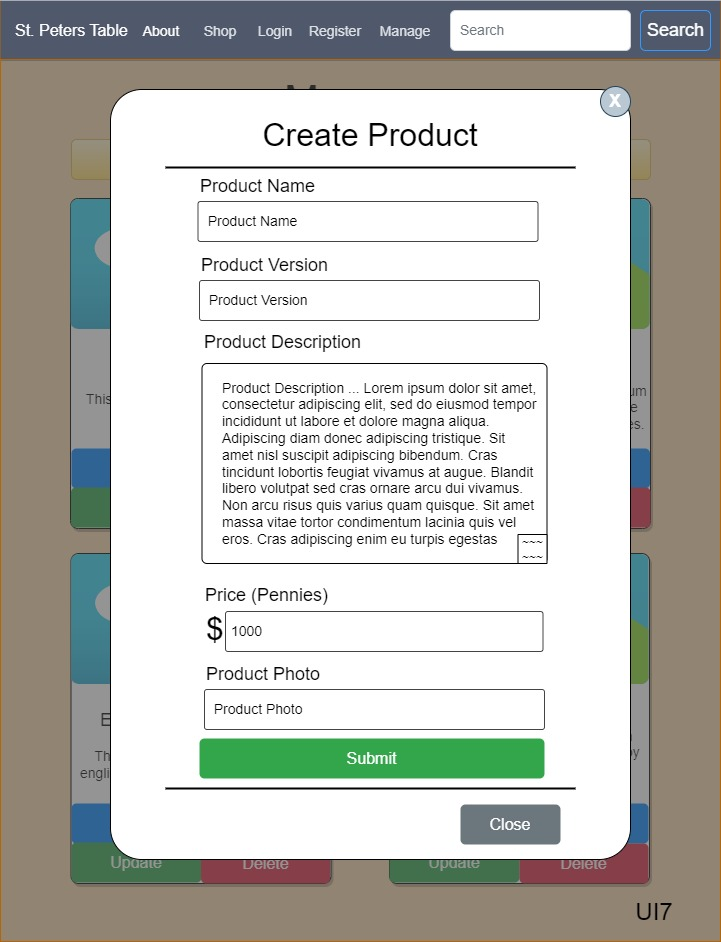

# Cover Sheet

### Class Number: CST-391
### Application Name: PetersTable
### Author: John Keen

---

# Introduction

My organization will be called Saint Peter’s Table.  It is a charitable non-profit organization that will sell bibles to sponsor their good deeds.  Saint Peter’s Table is about bringing people to the table in regard to providing food for them to eat and knowledge for their souls to flourish.  In the bible Jesus had asked Peter to feed and take care of his sheep.

>NIV Version
John 21:15-17
> 
> 15 When they had finished eating, Jesus said to Simon Peter, “Simon son of John, do you love me more than these?”
“Yes, Lord,” he said, “you know that I love you.”
Jesus said, “Feed my lambs.”
16 Again Jesus said, “Simon son of John, do you love me?”
He answered, “Yes, Lord, you know that I love you.”
Jesus said, “Take care of my sheep.”
17 The third time he said to him, “Simon son of John, do you love me?”
Peter was hurt because Jesus asked him the third time, “Do you love me?” He said, “Lord, you know all things; you know that I love you.”
Jesus said, “Feed my sheep.
>
This is not a task that Saint Peter alone should carry and we should all try to carry out the will of God.  We do not believe that God was merely referring to Peters ability to provide food but also to his ability to provide truth and spiritual wisdom that people could consume in order to be fulfilled by the Holy spirit.  Peter was sad because he had betrayed God three times and when Jesus asked Peter to take care of his sheep three times, he knew it was because he had sin that needed forgiven.  We all have sins to be forgiven and we all share Peter’s mission to help those in need.  Bibles will be sold to care for and feed people.

>ESV John 6:35
>
>Jesus said to them, “I am the bread of life; whoever comes to me shall not hunger, and whoever believes in me shall never thirst.
>

---
# Functionality

List of requirements in user story format:

- As a customer I would like to see all of the products so that I can browse for the bible I want.
- As a customer I would like to search for a particular product so that I can find the bible I need.
- As a customer I would like to see the details of the product so I can better know what I am purchasing.
- As a sales manager I would like to be able to create a product so that I can update our inventory.
- As a sales manager I would like to browse all of the products so that I can browse for a bible that may need information updated.
- As a sales manager I would like to search for a product by multiple criteria so that I can find the product that needs updated.
- As a sales manager I would like to be able to update a product so that I can keep the inventory information current.

---
# Initial Database Design

---
# Initial UI Sitemap

---
# Initial UI Wireframes

---
# Initial UML Classes

---
# Risks

