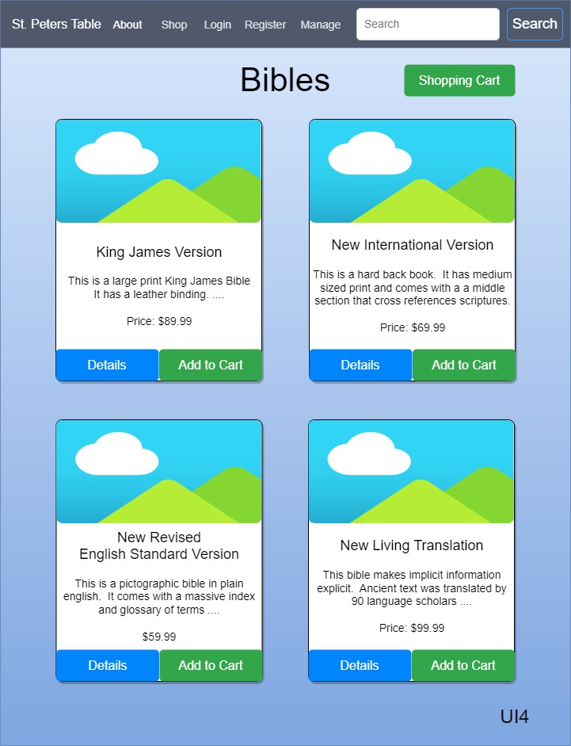

# Cover Sheet

### Class Number: CST-391
### Application Name: PetersTable
### Author: John Keen

---

# Introduction

---
# Functionality

---
# Initial Database Design

---
# Initial UI Sitemap

---
# Initial UI Wireframes

---
# Initial UML Classes

---
# Risks

